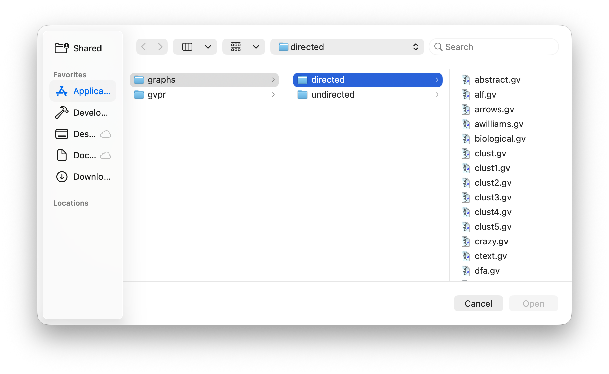
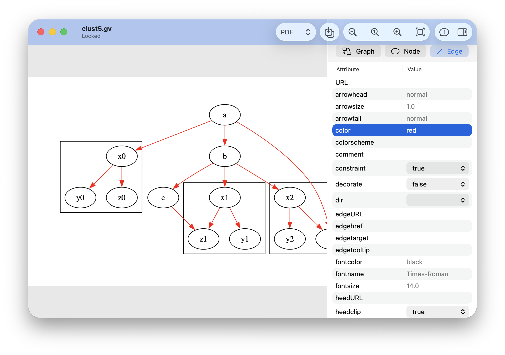
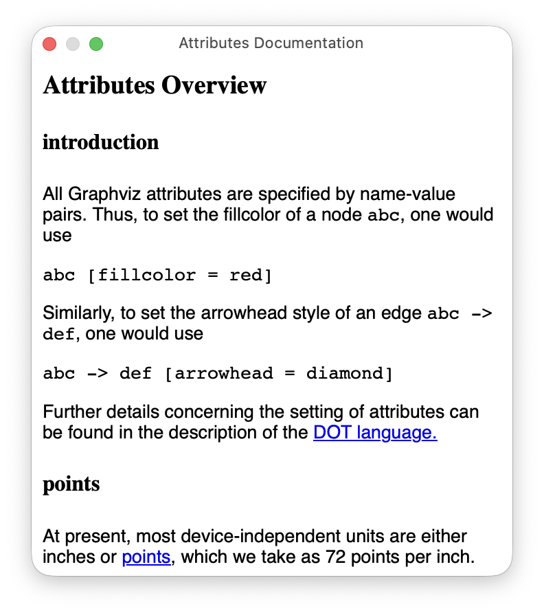

# Welcome to *GraphvizSwift*, the *Swift* language based macOS Graphviz Application.

- [Overview](#overview)
- [First Steps](#firststeps)
- [Building *GraphvizSwift*](#building-graphviz-swift)
- [Installing *GraphvizSwift*](#installing-graphviz-swift)
- [Running *GraphvizSwift*](#running-graphviz-swift)

## Overview

*GraphvizSwift* is a [macOS](https://www.apple.com/os/macos/) application that reads [Graphviz](https://graphviz.org) [DOT Language](https://graphviz.org/doc/info/lang.html) files for display. DOT defines the nodes and edges of a network graph, which Graphviz interprets to draw a network graph diagram. On macOS, Graphviz can use [Quartz](https://developer.apple.com/documentation/quartz) to render the diagrams into the following image formats: BMP, GIF, JPEG, PDF, PNG, SVG, and TIFF.

## First Steps

*macOS* Apps are built with [Xcode](https://developer.apple.com/xcode/), and you may download it from there, from the [Mac App Store](https://apps.apple.com/us/app/xcode/id497799835/), or from [Apple Developer Applications](https://developer.apple.com/download/applications/). *Xcode* also installs the Command Line Tools (e.g. `make`) for building *Graphviz*.

## Building *GraphvizSwift*

Clone the GraphvizSwift repo:
```zsh
git clone git@github.com:zosmac/graphviz_swift.git
```
Proceed to the repo and `make` the installer package:
```zsh
cd graphviz_swift
make pkg
```
This creates a macOS package installer `graphvizswift-arm64.pkg` that can install the GraphvizSwift App locally or distributed to install on other macOS hosts.

## Installing *GraphvizSwift*

Open the installer package:
```zsh
open graphvizswift-arm64.pkg
```
Enter the password for your macOS system account when prompted, and the app will be installed in /Applications/GraphvizSwift.app.

## Running *GraphvizSwift*

Once installed, you can find *GraphvizSwift* in the `/Applications` folder or through the App Launcher. Open the app, which will first present a document document navigator:



Graphviz installs a number of example DOT files (extension is .gv, as .dot was already registered for Microsoft DOcument Template files). Select from this list or navigate to other folders with your `.gv` files. Upon selection, *GraphvizSwift* presents a document view of the file:


The toolbar has a format selection popup menu that specifies the current image format. The default is PDF, which you can change in Settings:


With the popup you may select other rendering formats; the adjacent save button saves a file in that format. Next you will see several zoom options to change the size of the image. The message button, if highlighted in red, displays any error messages from rendering the graph:


The final button displays a sidebar for updating global graph, node, or edge attributes of the graph.



From the View menu, you can open Attributes Help for guidance:



You may also edit the file directly to update global attributes and to edit attributes for specific nodes, edges, or graph clusters. To enable edit mode, select GV from the format popup:


