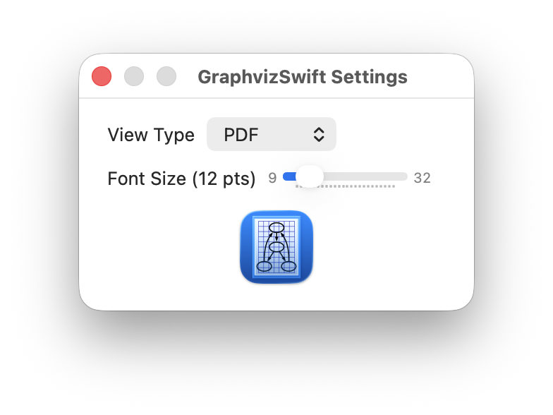

# Welcome to *GraphvizSwift*
## The *Swift* language based *macOS* *Graphviz* Application.

- [Overview](#overview)
- [Installing *GraphvizSwift*](#installing-graphvizswift)
  - [Download the *GraphvizSwift* Package Installer](#download-the-graphvizswift-package-installer)
  - [Clone and Build the *GraphvizSwift* Package Installer](#clone-and-build-the-graphvizswift-package-installer)
  - [Install *GraphvizSwift*](#install-graphvizswift)
- [Running *GraphvizSwift*](#running-graphvizswift)

## Overview
*GraphvizSwift* is a [macOS](https://www.apple.com/os/macos/) application that reads [Graphviz](https://graphviz.org) [DOT Language](https://graphviz.org/doc/info/lang.html) files for display. DOT defines the nodes and edges of a network graph, which *Graphviz* interprets to draw a network graph diagram. On *macOS*, *Graphviz* can use [Quartz](https://developer.apple.com/documentation/quartz) to render the diagrams into the following image formats: BMP, GIF, JPEG, PDF, PNG, SVG, and TIFF.

Note that *Graphviz* DOT language files by convention have the `.gv` extension. The `.dot` extension is registered for Microsoft DOcument Templates (Universal Type Identifier com.microsoft.word.dot).

## Installing *GraphvizSwift*
You have two choices for installing [GraphvizSwift](https://github.com/zosmac/graphviz_swift), either by downloading the package installer directly, or by cloning the repository and building the package installer.

Note that *GraphvizSwift* uses *WebKit*'s *WebView* and *WebPage*, *NotificationCenter*'s *MainActorMessage*, and *Liquid Glass* effects, all introduced with macOS 26 Tahoe.

### Download the *GraphvizSwift* Package Installer
You can install *GraphvizSwift* directly onto your Mac by downloading the package installer from [its repository](https://github.com/zosmac/graphviz_swift). Select `graphvizswift-arm64.pkg` and then download the raw file.


Similarly, download `graphvizswift-arm64.pkg.sha512`. Then, verify the package installer:
```zsh
cd ~/Downloads
sha512sum -c graphvizswift-arm64.pkg.sha512
```
If this reports `graphvizswift-arm64.pkg: OK`, then remove it from quarantine:
```zsh
xattr -d com.apple.quarantine graphvizswift-arm64.pkg
```

### Clone and Build the *GraphvizSwift* Package Installer

#### Install *Xcode*
To build the *GraphvizSwift* App, first download and install [Xcode](https://developer.apple.com/xcode/). *Xcode* provides the Command Line Tools (e.g. `git`, `make`) for building *Graphviz*, `xcodebuild` for building the *GraphvizSwift* App, and the IDE for *macOS* app development and testing.


#### Clone the *GraphvizSwift* Repository
```zsh
git clone git@github.com:zosmac/graphviz_swift.git
```

#### Build the Package Installer
Create the macOS package installer `graphvizswift-arm64.pkg` to install the *GraphvizSwift* App locally and to distribute it for installation on other macOS hosts.
```zsh
cd graphviz_swift
make pkg
```

### Install *GraphvizSwift*
Open the package installer:
```zsh
open graphvizswift-arm64.pkg
```
Enter the password for your macOS system account when prompted, and the app will be installed in /Applications/GraphvizSwift.app.

## Running *GraphvizSwift*
Once installed, find *GraphvizSwift* in the `/Applications` folder or via the App Launcher. Open the app, which will first present an open document navigator view. *Graphviz* includes a sample folder which is deployed with the *GraphvizSwift* app. In the document navigator, press the key combination &#8984;&#8679;G. This opens a sheet to enter a Unix path. The sample folder is `/Applications/GraphvizSwift.app/Contents/Frameworks/share/graphviz/graphs/directed`:


The *Graphviz* sample folder installs a number of example DOT files (extension is .gv):


Select from this list or navigate to other folders containing `.gv` files. Upon selection, *GraphvizSwift* presents a document view of the file. The toolbar has a **View Type** popup menu to set the desired rendering type. The default is PDF, which you can change in **Settings**. The adjacent **Save** button saves the file in that as that type, and next you will see several zoom options to change the size of the image:


The **Messages** button follows the zoom buttons. If highlighted in red, select it to display any error messages from rendering the graph:


The final button **Attributes** displays a sidebar for updating global graph, node, or edge attributes of the graph:


For guidance on setting attributes, from the **Window** menu select **Show Attributes Documentation**. Note that some of the links in the documentation open external sites. To return to the attributes documentation, select **Overview** below the title bar:


You may also edit the file directly to update global attributes and to edit attributes for specific nodes, edges, or clusters. To enable edit mode, select **GV** from the **View Type** popup:


With GraphvizSwift's **Settings**, you may configure several defaults for the app. The **View Type** popup menu specifies the type for rendering graphs. The default is PDF. You may also configure defaults for the **Layout Engine** for formatting graphs, the **Text Size** of *gv*, *canon*, and *json* renderings, and the **Input Scale** for node position points to inches conversion:


